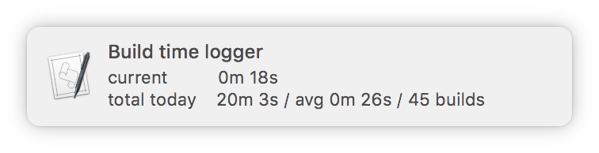
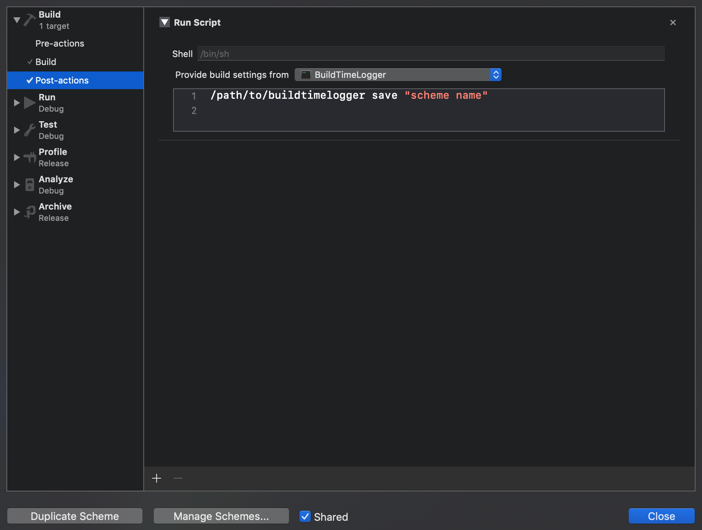
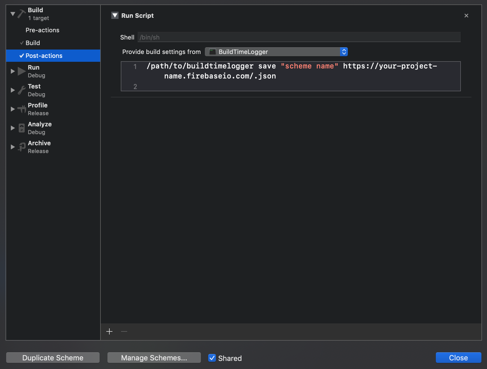

# BuildTimeLogger-for-Xcode
A console app for logging Xcode build times and presenting them in a notification right when the build finishes.
Optionally the app can upload and fetch each log entry to a REST API endpoint accepting POST requests.

Based on [BuildTimeAnalyzer-for-Xcode](https://github.com/RobertGummesson/BuildTimeAnalyzer-for-Xcode).
## Example notification

## Usage
1. Download BuildTimeLogger project, build and run it.
2. Copy the product (BuildTimeLogger app) into some easily accessible location.
3. In **your** Xcode project, edit scheme and add new Post-action in Build section:

   > Don't forget to select your target for _"Provide build settings from"_ list box.  




If you want to upload each log entry to a remote endpoint just specify the URL as a param:



As in the example, I tested that it works with [Firebase](https://firebase.google.com/), but it can potentially send the data to any REST API endpoint accepting POST requests.

## Viewing remotely stored logs

To see remotely stored results call the app (from terminal, outside the Xcode) with additional param:
```
$ /PATH/TO/BuildTimeLogger fetch https://your-project-name.firebaseio.com/.json json
```

Example output:
```
[
  {
    "username" : "yoan",
    "schemeName" : "BuildTimeLogger",
    "buildTime" : 3,
    "buildStatus" : "S"
    "time" : "14:23:05",
    "hostname" : "YoanBook-Pro",
    "date" : "02\/05\/2019"
  },
  {
    "username" : "yoan",
    "schemeName" : "BuildTimeLogger",
    "buildTime" : 5,
    "buildStatus" : "E"
    "time" : "14:47:21",
    "hostname" : "YoanBook-Pro",
    "date" : "02\/05\/2019"
  }
]
```

At your convenience, you can choose **csv** or **json** as output format. If you use different type of remote storage then you need to fetch/parse results yourself, as appriopriate.